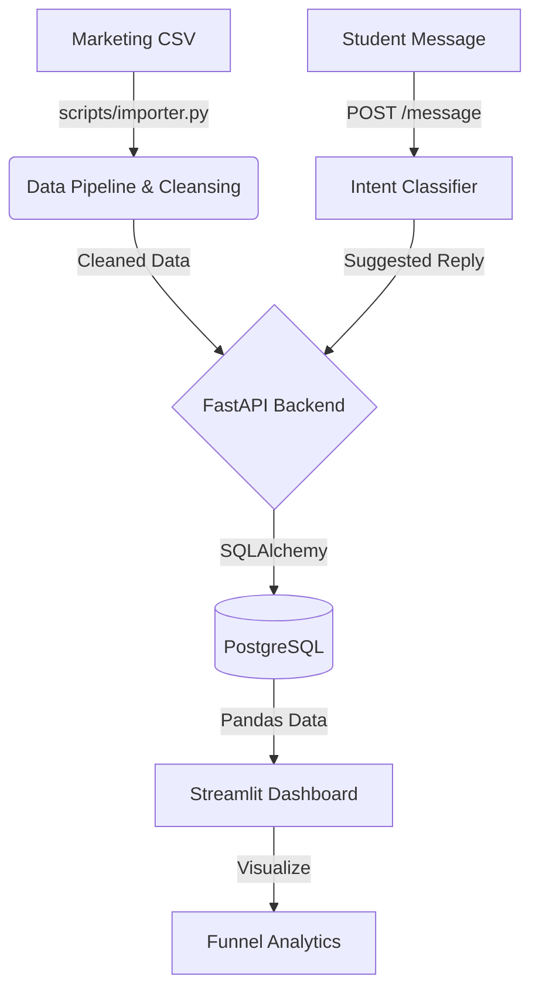

# AcademyOps

AcademyOps is a Lead-to-Enrollment Management System built for the EasySkill Career Academy (ECA). It captures leads from marketing channels, tracks them through a defined sales pipeline, supports counselor follow-up, and provides analytics on funnel performance.

## Project Structure

- `src/`: Core application source code
- `tests/`: Automated test suite
- `data/`: Local data and database files
- `scripts/`: Initialization and utility scripts

## Architecture



## Setup Instructions

1. **Clone the repository**:
   ```bash
   git clone <repository_url>
   cd AcademyOps
   ```

2. **Set up the virtual environment (Requires Python 3.11+)**:
   - Create a virtual environment:
     ```bash
     python -m venv venv
     ```
   - Activate the virtual environment:
     - On Windows: `.\venv\Scripts\activate`
     - On macOS/Linux: `source venv/bin/activate`

3. **Install dependencies**:
   ```bash
   pip install -r requirements.txt
   ```

## How to Run

1. Initialize the Database (FastAPI/SQLAlchemy):
   ```bash
   python -m src.db_init_sqlalchemy
   ```
2. Start the FastAPI server (using Uvicorn):
   ```bash
   uvicorn src.main:app --reload
   ```
   *Note: This will open the API at `http://127.0.0.1:8000`. You can view the auto-generated Swagger UI docs at `http://127.0.0.1:8000/docs`.*

## API Reference

The REST API is available at `http://127.0.0.1:8000/api/v1/leads`.

### Endpoints

- `GET /api/v1/leads`: List leads (Supports `?stage=New&source=Website&page=1&limit=20`)
- `GET /api/v1/leads/{id}`: Retrieve a specific lead
- `POST /api/v1/leads`: Create a new lead
  ```json
  { "name": "John Doe", "phone": "555-1234", "source": "Website", "notes": "Interested" }
  ```
- `PATCH /api/v1/leads/{id}/stage`: Update a lead's stage
  ```json
  { "stage": "Contacted" }
  ```
- `DELETE /api/v1/leads/{id}`: Delete a lead
- `POST /api/v1/leads/{id}/message`: Classify a student message (WP-08)
  ```json
  { "message": "What are the fees?" }
  ```

## WP-04: Automated Tests

To run the test suite:
```bash
pytest -v tests/
```

## WP-05 & WP-06: Analytics & Operations Dashboard

To view the internal operations dashboard (which includes funnel analytics, source conversions, and recent leads):
```bash
streamlit run src/dashboard.py
```
This will open the dashboard in your default web browser.
